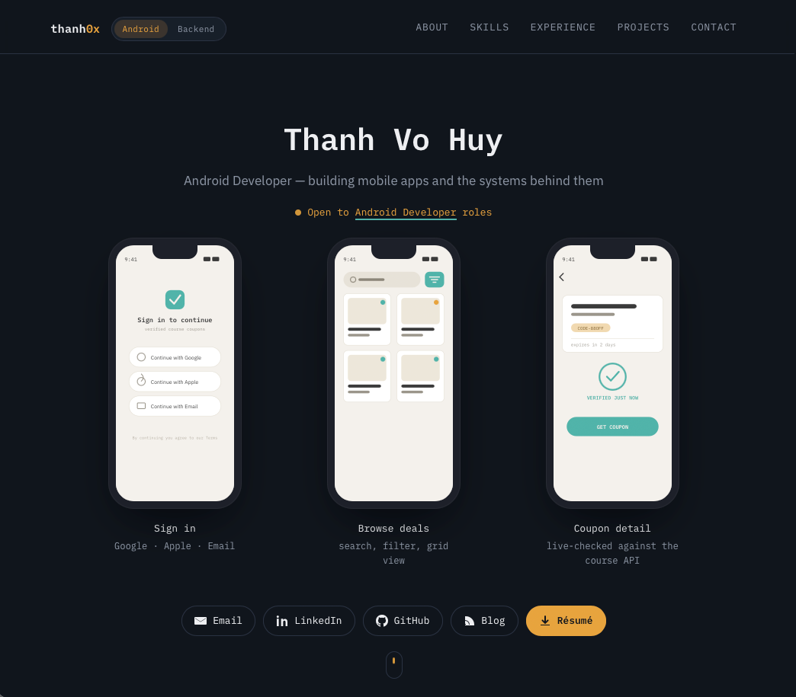
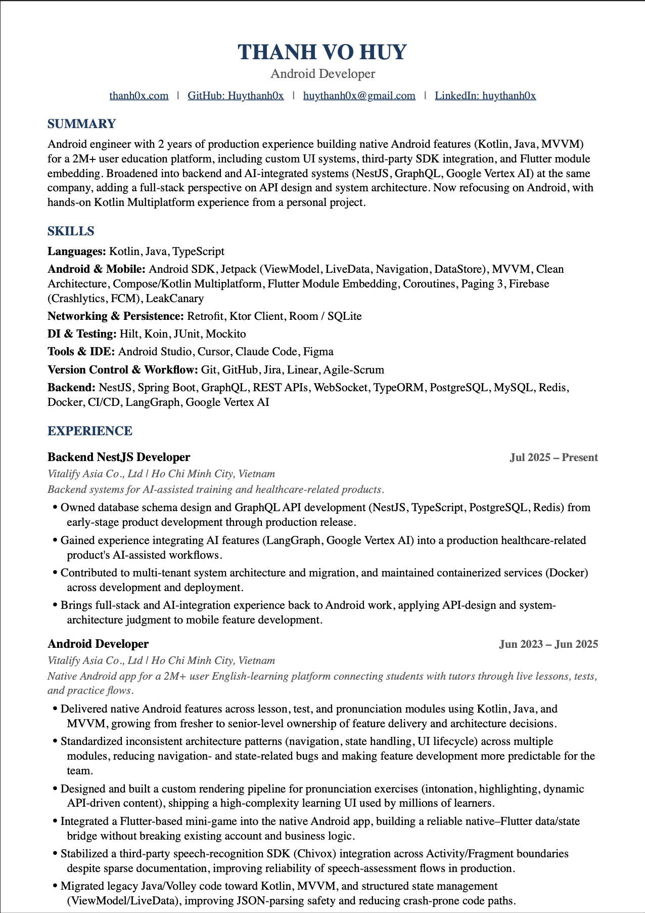

# [thanh0x.com](https://thanh0x.com) - my portfolio site as an **Android Developer**

The site is plain HTML, CSS, and JavaScript with no frontend build step. Resume PDF generation lives in `resume-src/` and outputs into `assets/`.

**CV PDF:** [Thanh_VoHuy_Android_Resume.pdf](https://thanh0x.com/assets/Thanh_VoHuy_Android_Resume.pdf)

## Preview

### Portfolio

<p align="center">
  <a href="https://thanh0x.com">
    
  </a>
</p>

### CV

<p align="center">
  <a href="assets/Thanh_VoHuy_Android_Resume.pdf">
    
  </a>
</p>

## Project structure

```
.
├── index.html              # Portfolio page
├── style.css               # Styles
├── script.js               # Nav, hero view switch, terminal animation
├── CNAME                   # Custom domain for GitHub Pages
├── assets/
│   ├── avatar.jpg
│   ├── IELTS_cerfificate.png
│   ├── preview_cv.png
│   ├── preview_portfolio.png
│   └── Thanh_VoHuy_Android_Resume.pdf   # Generated by resume-src
└── resume-src/
    ├── build_resume.js     # Resume content + DOCX generation
    ├── convert_to_pdf.js   # DOCX → PDF via Puppeteer
    ├── resolve_chrome.js   # Chrome/Chromium discovery for PDF export
    ├── package.json
    └── .env.example
```

## Local development

The portfolio itself needs no install or build. Open the `index.html` and the page lives.

## Updating the portfolio

| What to change | Where |
|---|---|
| Page content (experience, projects, skills, etc.) | `index.html` |
| Layout and styling | `style.css` |
| Nav, Android/Backend view switch, terminal animation | `script.js` |
| Resume download link | Already points at `assets/Thanh_VoHuy_Android_Resume.pdf` |

## Building the resume

Resume content is defined in `resume-src/build_resume.js`. Running the build:

1. Generates `assets/Thanh_VoHuy_Android_Resume.docx` (gitignored)
2. Converts it to `assets/Thanh_VoHuy_Android_Resume.pdf` for the site download button

### Setup

```bash
cd resume-src
npm install
```

`npm install` also runs `postinstall`, which downloads Chrome for Puppeteer. If PDF conversion fails, you can instead use a system Chrome/Chromium install or set `PUPPETEER_EXECUTABLE_PATH`.

### Build

```bash
cd resume-src
npm run build
```

### Optional: phone number on resume

By default the resume omits a phone number so the generated PDF is safe to publish. To include one for a private copy:

```bash
cp .env.example .env
# set PHONE_NUMBER=+84...
npm run build
```

`.env` is gitignored.

### Where to edit resume content

- **URLs and project links:** `LINKS` object at the top of `build_resume.js`
- **Sections, bullets, experience, education:** document body in `build_resume.js`

After changing resume content, run `npm run build` and commit the updated PDF in `assets/`.

## Deployment

The repo is set up for **GitHub Pages** with a custom domain via `CNAME` (`thanh0x.com`).

Typical flow:

1. Edit site and/or rebuild the resume PDF
2. Commit and push to the Pages branch (`main`)
3. GitHub Pages serves the static files from the repo root

No CI workflow is configured — deployment is push-to-publish.

## Tech notes

- **Fonts:** IBM Plex Sans & IBM Plex Mono (Google Fonts)
- **Resume pipeline:** [`docx`](https://www.npmjs.com/package/docx) → DOCX, then [`docx-preview`](https://www.npmjs.com/package/docx-preview) + [`puppeteer`](https://www.npmjs.com/package/puppeteer) → PDF

## License

This project is licensed under the [MIT License](LICENSE).